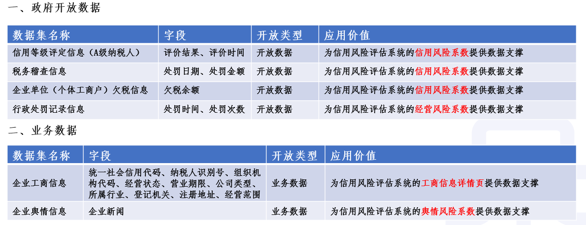
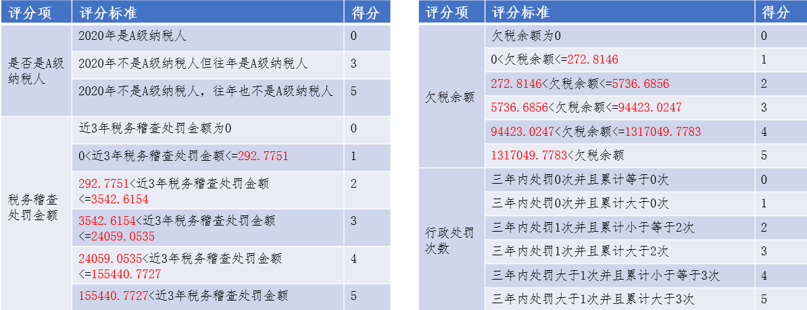
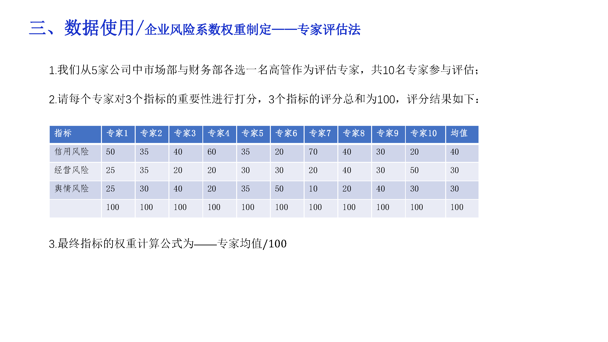

# Open-Data-Competetion
浙江省北大信息技术高等研究院-商探团队的开放数据应用大赛作品——企业经营信用风险评估系统

## 应用原型

本次大赛作品以移动APP
的形式进行开发并封装成应用，该应用包括企业首页，企业详情页，企业工商信息页和企业风险详情页。企业首页可用于查询企业；企业详情页展示了被查询企业的基本信息，各类详细信息如工商信息，风险信息可通过点击相应按钮查看；企业工商信息页展示了企业的工商信息；企业风险详情页展示了该企业的4种风险，包括经营风险，信用风险，舆情风险以及整体风险，并给出了综合评价与合作建议，同时可以进一步查看这些系数的计算来源。

## 数据清单
使用的数据清单如下图所示

## 经营/信用风险系数计算

我们采用打分制构建4个维度的特征，分别为：`是否为A级纳税人`,`税务稽查处罚金额`,`欠税余额`,
`行政处罚次数`。其中对于`是否为A级纳税人`以及`行政处罚次数`，我们采用统计的方法构建得分边界，对于`税务稽查处罚金额`与`欠税余额`，我们采用数据分析+聚类方法计算得分边界，计算流程图如下图所示

每家公司的信用/经营风险系数为特征的加权平均

## 舆情风险系数计算

企业舆情均为百度，搜狗上公开的企业新闻，通过搜索获得。对获取的舆情信息，我们采用自然语言处理技术模型BERT-CNN对文本进行分类，该模型对每条文本进行判别后，输出对应的舆情情感方向与舆情主题类别，其中情感方向包括3类，舆情主题包括6
类，每一类均对应一个分数，将一家企业的所有舆情通过模型判别后，使用舆情风险系数模型进行计算，得到该企业最终的舆情风险系数。

## 整体风险系数计算

整体风险系数为经营系数，风险系数，舆情系数3者的加权平均和，为确定每一类系数的重要性，我们采用专家评定法获得每一类风险系数的权重，专家评定表如下图所示

根据专家评定表可以得出权重比为0.4:0.3:0.3,假如某个企业的上述三项风险系数分别为3.2，4.3，4.1，则整体风险指数为3.
8，并可以得出综合评价以及合作建议。 
综合评价：该企业的经营风险中等、信用风险较高、舆情风险较高，整体风险指数较高， 企业综合状况较高 
合作建议：暂不考虑业务往来。
## 后期展望
企业经营信用风险评估一直是每个企业的关心点，也是一个较难的研究点。本次借着浙江数据开放大赛，将我们的想法进行一个比较初级实践，并觉得后期仍有很大的空间进行改进与迭代，具体包括：
1. 结合更多用户的反馈，将风险系数的计算体系进一步完善与迭代，尤其权重的计算；
2. 考虑加入相关风险评估，因为一个公司出现重大经营风险，则与其关联的公司也会受到影响，尤其母子公司类的。
3. 在应用中添加类似“举报”机制的功能，让受害的企业举报不良的企业，然后进行审核，公开，减少不良企业进一步的危害；
4. 考虑与专业的风险评估机构合作，加强风险体系的构建与风险指标的建设；
