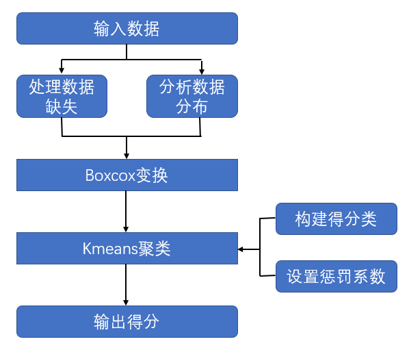
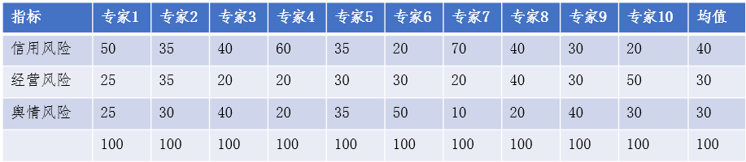

# Open-Data-Competetion
浙江省北大信息技术高等研究院-商探团队的开放数据应用大赛作品——企业经营信用风险评估系统

本次大赛作品以移动APP
的形式进行开发并封装成应用，该应用包括企业首页，企业详情页，企业工商信息页和企业风险详情页。企业首页可用于查询企业；企业详情页展示了被查询企业的基本信息，各类详细信息如工商信息，风险信息可通过点击相应按钮查看；企业工商信息页展示了企业的工商信息；企业风险详情页展示了该企业的4种风险，包括经营风险，信用风险，舆情风险以及整体风险，并给出了综合评价与合作建议，同时可以进一步查看这些系数的计算来源。使用的数据清单如下图所示

## 经营/信用风险系数计算

我们采用打分制构建4个维度的特征，分别为：`是否为A级纳税人`,`税务稽查处罚金额`,`欠税余额`,
`行政处罚次数`。其中对于`是否为A级纳税人`以及`行政处罚次数`，我们采用统计的方法构建得分边界，对于`税务稽查处罚金额`与`欠税余额`，我们采用数据分析+聚类方法计算得分边界，计算流程图如下图所示

每家公司的信用/经营风险系数为特征的加权平均

## 舆情风险系数计算

企业舆情均为百度，搜狗上公开的企业新闻，通过搜索获得。对获取的舆情信息，我们采用自然语言处理技术模型BERT-CNN对文本进行分类，该模型对每条文本进行判别后，输出对应的舆情情感方向与舆情主题类别，其中情感方向包括3类，舆情主题包括6
类，每一类均对应一个分数，将一家企业的所有舆情通过模型判别后，使用舆情风险系数模型进行计算，得到该企业最终的舆情风险系数。

## 整体风险系数计算

整体风险系数为经营系数，风险系数，舆情系数3者的加权平均和，为确定每一类系数的重要性，我们采用专家评定法获得每一类风险系数的权重，专家评定法如下图所示

## 后期展望

